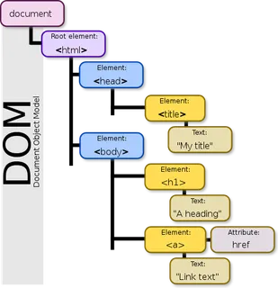

🔥DOM Manipulation🔥

🎯 What is DOM?

--> The Document Object Model (DOM) is a programming interface for HTML and\ XML documents that defines the logical structure of documents and the way\
they are accessed and manipulated.

1. It represents a document as a tree structure where each node is an object\ representing a part of the document.
2. The DOM allows programming languages like JavaScript to interact with the\ page, create, change, or remove elements from the document, and add events\
   to these elements to make the page more dynamic.
3. The DOM translates the content of an HTML document into a standardized object that functional programming languages like JavaScript can easily access and modify.

🎯 4 Pillars of DOM ✅

-->
1️⃣ Selecting of an element

🌟Exmp:

        let a = document.querySelector('h1');
        console.log(a);

2️⃣ Changing HTML

🌟Exmp:

        let a = document.querySelector('h1');
        a.innerHTML = 'Changed text';

3️⃣ Changing CSS

🌟Exmp:

        let a = document.querySelector('h1');
        a.style.color = 'red';

4️⃣ Event Listener

🌟Exmp:

        let a = document.querySelector('h1');
        a.addEventListener('click', function(){
            console.log('hey');
        });

🎯 Simple example of bulb or wharever clicking on the same button

🌟Exmp:

📌 index.html

        <!DOCTYPE html>

        <html lang="en">

        <head>
            <meta charset="UTF-8">
            <meta name="viewport" content="width=device-width, initial-scale=1.0">
            <title>DOM Manipulation</title>
            <link rel="stylesheet" href="./style.css">
        </head>

        <body>

            

            <button>ON</button>
            

        </body>

        </html>

📌 style.css

            * {
                margin: 0;
                padding: 0;
                box-sizing: border-box;
            }

            html, body {
                height: 100%;
                width: 100%;
                background-color: black;
                color: white;
            }

            #bulb{
                height: 300px;
                width: 300px;
                border-radius: 50%;
                border: 4px solid white;
            }

            button{
                padding: 10px 30px;
                font-size: 20px;
                margin: 50px;
            }

📌 script.js

        let bulb = document.querySelector('#bulb');
        let btn = document.querySelector('button');

        btn.addEventListener('click', function () {
            if (btn.innerHTML == 'ON') {
                bulb.style.backgroundColor = 'yellow';
                btn.innerHTML = 'OFF';
            }
            else {
                bulb.style.backgroundColor = 'white';
                btn.innerHTML = 'ON';
            }
        })

🎯 Multiple events
🎯 Selecting multiple elements at same time

🌟Exmp: 

📌index.html

    <!DOCTYPE html>
    <html lang="en">
    
    <head>
        <meta charset="UTF-8">
        <meta name="viewport" content="width=device-width, initial-scale=1.0">
        <title>DOM Manipulation</title>
        <link rel="stylesheet" href="./style.css">
    </head>
    
    <body>
    
        <h1>hello1</h1>
        <h1>hello2</h1>
        <h1>hello3</h1>
        <h1>hello4</h1>
    
    
    
    
    
        
    </body>
    
    </html>

📌 style.css

    * {
        margin: 0;
        padding: 0;
        box-sizing: border-box;
    }

    html, body {
        height: 100%;
        width: 100%;
        background-color: black;
        color: white;
    }

    h1{
        font-size: 5vw;
    }

📌 script.js

    let h1s = document.querySelectorAll('h1');
    h1s.forEach(function(elem){
        elem.style.color = 'red';
        elem.style.backgroundColor = 'yellow';
    });

